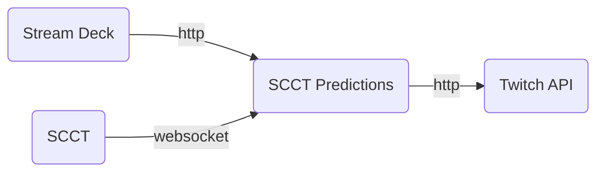

# SCCT Predictions

Standalone program that creates and pays out Twitch predictions based on data from the current match in the [StarCraft Casting Tool (SCCT)](https://teampheenix.github.io/StarCraft-Casting-Tool/).

This application is designed to integrate with the Elgato Stream Deck but could also integrate with any tool that can send HTTP requests to its endpoints.

## Installation (Windows)

1. Download the latest `scct_predictions-<version>-windows-amd64.zip` file from https://github.com/jaedolph/scct_predictions/releases/latest
2. Copy the zip to a location such as "Documents"
3. Right click and select "Extract here"
4. Run the `install.bat` script. Close the window when it completes.
5. Run the `run.bat` script. On first run, the configuration utility should open in your browser.

## Updating Configuration
Browse to the setup page at http://localhost:5123/configure

## Architecture

